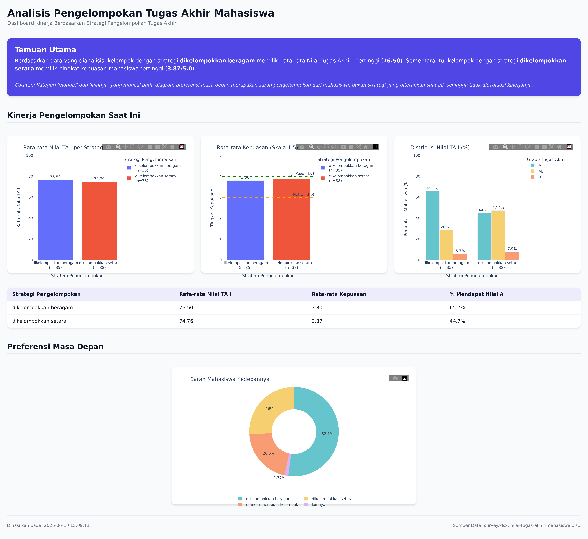

# Analisis Pengelompokan Tugas Akhir Mahasiswa

This program analyzes the relationship between students' grouping strategies for their final project (Tugas Akhir I) and their academic performance and satisfaction. It processes survey and grade data to generate an interactive, static HTML dashboard for easy visualization and decision-making.



## Features

- **Data Integration**: Merges subjective survey responses with objective academic grades.
- **Automated Analysis**: Calculates average TA I scores, average satisfaction scores, and grade distributions across different grouping strategies.
- **Interactive Dashboard**: Generates `dashboard.html` using Plotly, featuring:
  - High-level automated findings summary.
  - Side-by-side performance comparisons.
  - Percentage-based grade distribution breakdowns.
  - An interactive summary data table.
  - Visualizations of students' future grouping preferences.

## Usage

1. **Install Dependencies**:
   Ensure you have Python installed, then install the required packages:
   ```bash
   pip install -r requirements.txt
   ```

2. **Run the Analysis**:
   Execute the main script to process the data and generate the dashboard:
   ```bash
   python main.py
   ```

3. **View the Dashboard**:
   Open the newly generated `dashboard.html` file in your preferred web browser.

## Expected Data Schema

To run this tool successfully, the input Excel files (placed in the `data/` directory) must adhere to the following schemas. Configuration mappings can be adjusted in `config.py`.

### 1. Survey Data (`survey.xlsx`)
- **Required Columns**:
  - `'NIM '` or `'NIM'`: The unique identifier for the student.
  - `'Program Studi'`: Determines the currently implemented grouping strategy via config mapping.
  - `'Apakah anda puas dengan metode pengelompokan Tugas Akhir saat ini?'`: Satisfaction score (e.g., scale of 1-5).
  - `'Apa saran anda tentang pengelompokan tugas akhir di masa yang akan datang?'`: The future grouping preference column.
- **Expected Data**:
  - The grouping suggestion column must contain text that fuzzy-matches predefined canonical keys defined in `config.py` (e.g., `"beragam"`, `"setara"`, `"sendiri"` / `"mandiri"`).

### 2. Grades Data (`nilai-tugas-akhir-mahasiswa.xlsx`)
- **Required Columns**:
  - `'NIM'`: The unique identifier for the student.
  - `'Grade Tugas Akhir I'`: The student's grade.
- **Expected Data**:
  - The grades should be standard categorical Indonesian GPA grades: `A`, `AB`, `B`, `BC`, `C`, `D`, `E`.
  - Unrecognized or empty grades will be mapped to `NaN` and dropped from the average calculations.

## Configuration

You can customize file paths, grade-to-score mappings, and grouping categorizations by editing the variables in `config.py`.
